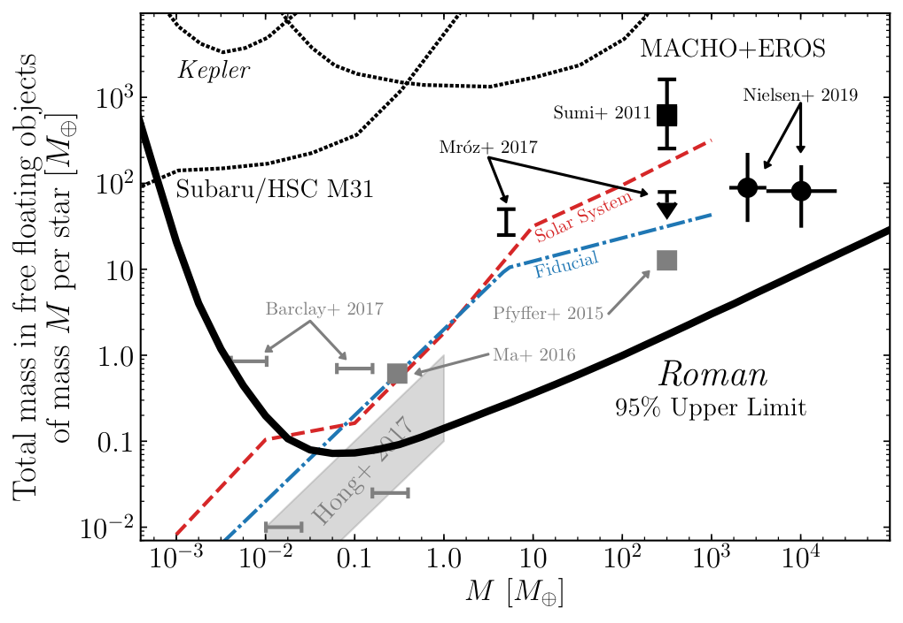
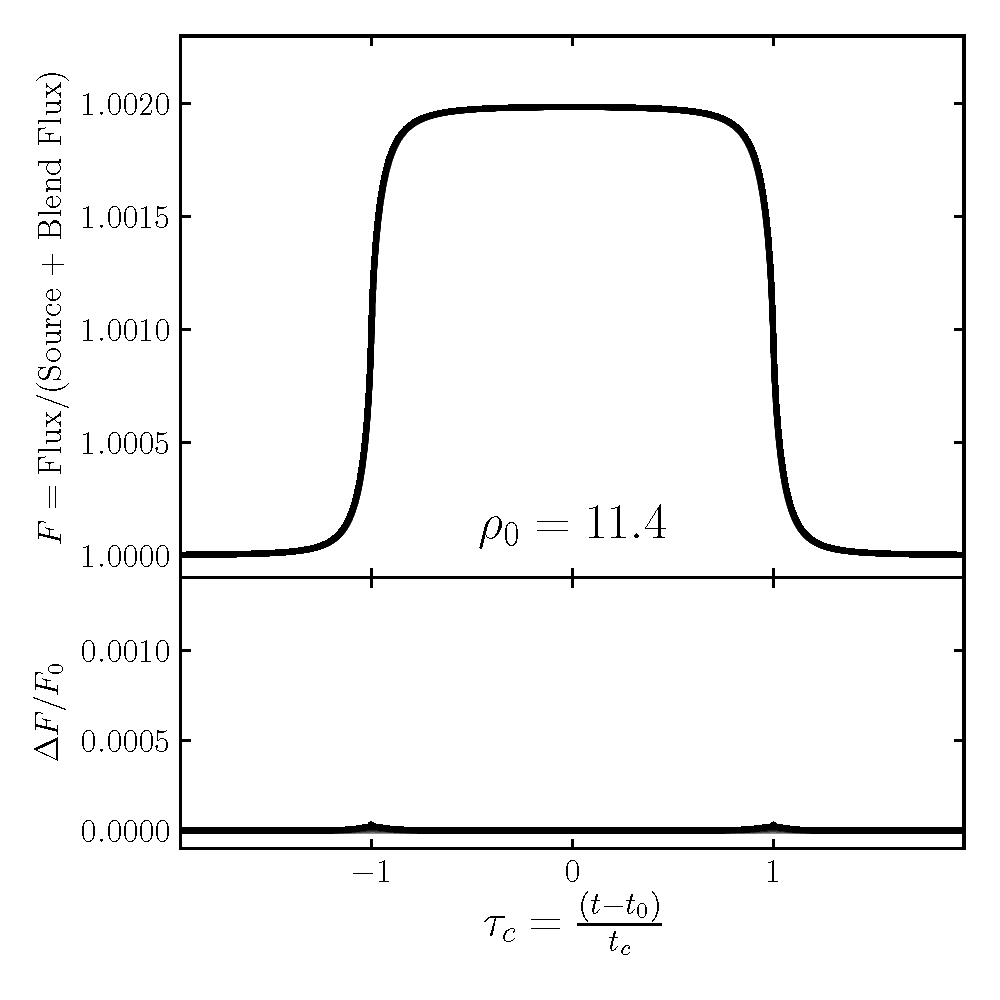
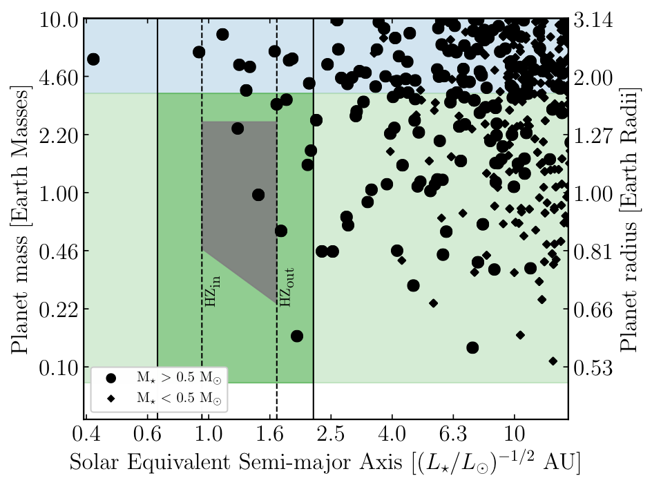
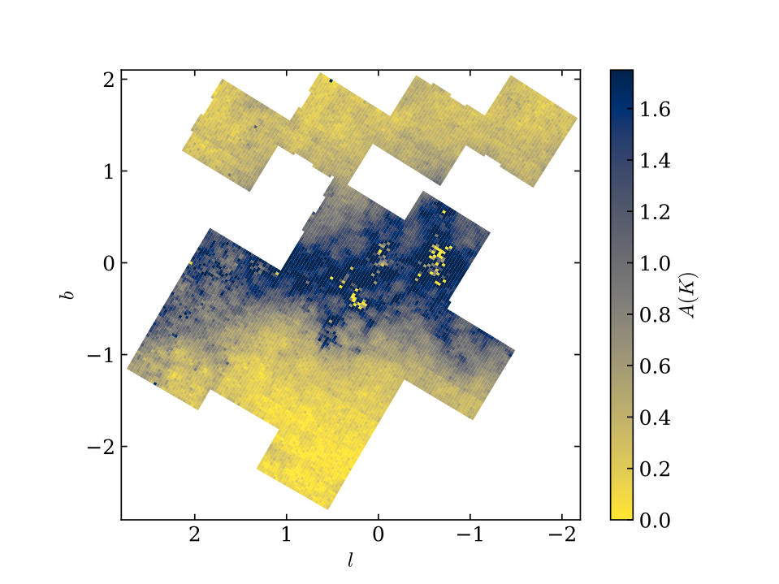

# {{page.title}}

## Free-floating Planets

They main focus of my work has been predictions for the *Roman* Galactic Bulge Time Domain Survey. I recently put out a paper on what *Roman* can help us learn about the frequency of free-floating planets. If these rogue planets have the same distribution as cold planets that are bound to host stars, roughly 250 will be detected by *Roman*.

The above plot shows the 95% confidence limit *Roman* will be able to place on populations of free-floating planetary mass objects in the Milky Way if it makes no detections. Think of the vertical axis as $$M_p dN/d\log{M_p}$$. This value sits well below the current best limits, and will test many predictions from planet formation (the gray markers). For information, see the recent paper [here](https://ui.adsabs.harvard.edu/abs/2020arXiv200610760J/abstract).

In pursuing these predictions on free-floating planets, we uncovered a multi-parameter degeneracy for microlensing events that show extreme finite source effects. This degeneracy can be mathematically severe (see figure below, where nine light curves almost perfectly overlap despite having very different parameters), its physical extent can be constrained. For details on this degeneracy, see the recent paper [here](https://ui.adsabs.harvard.edu/abs/2021arXiv210908161J/abstract). 

## Earth-analog Systems
I am working on what *Roman* will tell us about the frequency of Earth-analog systems. While *Roman* will not have the best sensitivity to these planets, it will for those with larger star-planet separations and higher mass planets. With these, *Roman* detections can be used to extrapolate to the parameter space region of interest. This is shown in the figure below, which plot shows a simulated drawing of *Roman* detected planets. Note that the semi-major axis has been scaled to that of equivalent flux if the planet orbitted the Sun, and we use [Chen & Kipping (2016)](https://ui.adsabs.harvard.edu/abs/2017ApJ...834...17C/abstract) to scale mass to radius of the planets. 

## Galactic Model for Microlensing Simulations

In conjuction, I am working on a modular Galactic population-synthesis model with an OSU undergraduate Abigail Aronica. This model is meant to be public and easily customizable. This will be publically available, but there is a decent of development still left to do. 

## Dust Map of the Galactic Center

I also spent the summer of 2019 working on making an extinction map towards the Galactic bulge using UKIRT data. I am advising OSU undergraduate [Aiden Zelakiewicz](https://www.linkedin.com/in/zelakiewicz) to finish this work, which will be used in finding the final location the *Roman* Galactic Bulge Time Domain Survey fields.

## Predicting *Roman*'s ability to detect primordial black holes 

I am co-advising OSU undergraduate Rachel Slaybaugh on making predictions on the constraints *Roman* will be able to place on the fraction of the Milky Way halo composed of Earth-mass primordial black holes through a microlensing survey toward M31. 
